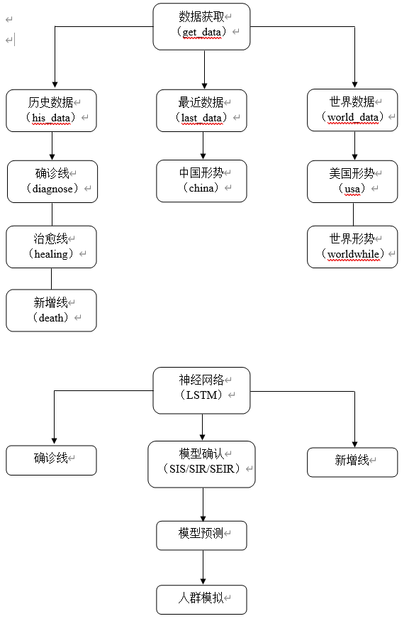

# 中美COVID-19疫情可视化及预测分析（2019-2020）


2020年数据挖掘的课设，包含数据的可视化及利用SEIR模型进行预测。（Visualization and prediction analysis of covid-19 epidemic situation in China and the United States (2019-2020)）


多说一句，现在是2022年，上海又开始无症状疫情，额……emmmmmm，不好评价。


## 一、项目需求分析

### 1.1 项目介绍


自从2019年年末开始，到现在此项目完成时，新型冠状病毒（COVID-19）始终是一个社会生活中的热点话题，从国内到国外，从过去到现在，这场与病毒的战斗仍在持续。从潜伏人数到确诊人数，从死亡率到治愈率，从爆发点到增长拐点，从一国到世界……每一个名词所跟随的一个个阿拉伯数字构成了贯穿在这场战役中的一条条数据，而这一条条的数据又无时不刻牵动着人们的心弦，这些数据所代表的意义不凡，从无形的数据中抽象出清晰明了的逻辑线索，将一维的线性数据升维到二维的可视，表现规律，再从规律中拟合模型，推测未来的走势与发展，这样的工作正好是数据挖掘与分析的专长领域。


在本项目中，我将利用从多个官方可信网站公布的数据提取数据集，整合重构数据后，进行数据的可视化，以便清晰的分析疫情形势；再通过神经网络进行机器学习，对数据学习分析后配合SEIR传播模型，对疫情进行模拟与预测。

 

### 1.2 功能需求


* 1. 疫情数据的提取与清洗处理，重构后生成数据集；


* 2. 导入合适的可视化方法库，将数据带入后进行数据多层可视化；


* 3. 将数据集分为训练集与测试集，构造神经网络进行机械学习；


* 4. 利用SEIR模型，合理设置各项参数，进行预测；


* 5. 将模型与学习结果结合后，导入人群模拟演示。


 

## 二、项目分析与设计

### 2.1 本项目需解决的关键技术问题


* 1. 如何从官方发布网站实时获取数据更新，怎样提取json文件中的数据构建数据集；


* 2. 数据怎样处理便于适配可视化库函数，进行数据可视化操作；


* 3. 选取什么类型的神经网络构建便于机械学习；


* 4. 机械学习的训练集与测试集的合理划分；


* 5. SEIR模型的各项参数意义，怎样对其进行改进，使之更加合理，对于此次疫情更加适配；


* 6. 怎样理解与看待通过数据、数据挖掘、数据分析及数据预测后得到的预测与模型拟合的结果。


### 2.2 项目流程





### 2.3 功能模块

* 1. 数据获取：从官方可信渠道实时获取json文件后提取数据，划分为历史数据，最近数据，世界数据三部分；

* 2. 线与形势：分别用折线图与地图形式可视化数据表述；

* 3. 神经网络：先进行数据处理，然后神经网络训练与机器学习训练，再进行数据预测与实际数据折线同轴同面对比；

* 4. 模型确认：对SIS模型、SIR模型、SEIR模型分别进行简单实现后，选择SEIR模型进行下一步数据预测；

* 5. 模型预测：利用SEIR模型进行中美两国疫情预测；

* 6. 人群模拟：将模型预测趋势导入人群运动模型，观察推演。


 

## 三、项目设计与实现

### 3.1 项目设计

#### 3.1.1 数据获取：


从国家及各地卫健委每日信息发布提取国内历史数据及最新数据

```python
def get_last_data():
    import requests
    url = r"""https://view.inews.qq.com/g2/getOnsInfo?name=disease_h5&_={0}""".format(int(time.time()*1000))
    result = requests.get(url)
    data = json.loads(result.json()['data'])

    return data

def get_hist_data():
    import requests
    url = r"""https://view.inews.qq.com/g2/getOnsInfo?name=disease_other&_={0}""".format(int(time.time()*1000))
    result = requests.get(url)
    data = json.loads(result.json()['data'])

return data
```


从WHO和霍普金斯大学网站发布数据提取世界数据

```python
def get_world_data():
    import requests
    url 
=r"""https://view.inews.qq.com/g2/getOnsInfo?name=disease_foreign&_={0}""".format(int(time.time()*1000))
    result = requests.get(url)
    data = json.loads(result.json()['data'])

    return data
```


#### 3.1.2 神经网络：


数据处理后，进行神经网络的构建与机械学习

```python
# 数据预处理
import pandas as pd
df = pd.read_excel('real_data.xlsx')
value = df['全国累计确诊'].values[10:67]
print(value)
print(len(value))
x = []
y = []
seq = 3
for i in range(len(value)-seq-1):
    x.append(value[i:i+seq])
    y.append(value[i+seq])
#print(x, '\n', y)

train_x = (torch.tensor(x[0:40]).float()/100000.).reshape(-1, seq, 1)
train_y = (torch.tensor(y[0:40]).float()/100000.).reshape(-1, 1)
test_x = (torch.tensor(x[40:57]).float()/100000.).reshape(-1, seq, 1)
test_y = (torch.tensor(y[40:57]).float()/100000.).reshape(-1, 1)
print(test_y)
# 模型训练
class LSTM(nn.Module):
    def __init__(self): 
        super(LSTM, self).__init__()
        self.lstm = nn.LSTM(input_size=1, hidden_size=16, num_layers=1, batch_first=True)
        self.linear = nn.Linear(16 * seq, 1)
    def forward(self, x):
        x, (h, c) = self.lstm(x)
        x = x.reshape(-1, 16 * seq)
        x = self.linear(x)
        return x

# 模型训练
model = LSTM()
optimzer = torch.optim.Adam(model.parameters(), lr=0.005)
loss_func = nn.MSELoss()
model.train()

for epoch in range(400):
    output = model(train_x)
    loss = loss_func(output, train_y)
    optimzer.zero_grad()
    loss.backward()
    optimzer.step()
    if epoch % 20 == 0:
        tess_loss = loss_func(model(test_x), test_y)
        print("epoch:{}, train_loss:{}, test_loss:{}".format(epoch, loss, tess_loss))
```


#### 3.1.3 传播模型


以SEIR模型为例，设定参数，进行模拟计算

```python
# N为人群总数
N = 10000
# β为传染率系数 
beta = 0.2
# gamma为恢复率系数
gamma = 0.1
# Te为疾病潜伏期
Te = 10
# I_0为感染者的初始人数
I_0 = 1
# E_0为潜伏者的初始人数
E_0 = 0
# R_0为治愈者的初始人数
R_0 = 0
# S_0为易感者的初始人数
S_0 = N - I_0 - E_0 - R_0
# T为传播时间
T = 150

# INI为初始状态下的数组
INI = (S_0,E_0,I_0,R_0)

def funcSEIR(inivalue,_):
    Y = np.zeros(4)
    X = inivalue
 # 易感个体变化
    Y[0] = - (beta * X[0] *( X[2]+X[1])) / N
 # 潜伏个体变化
    Y[1] = (beta * X[0] *( X[2]+X[1])) / N - X[1] / Te
 # 感染个体变化
    Y[2] = X[1] / Te - gamma * X[2]
 # 治愈个体变化
    Y[3] = gamma * X[2]
    return Y

T_range = np.arange(0,T + 1) 
RES = spi.odeint(funcSEIR,INI,T_range)
```

 


#### 3.1.4 基于SEIR的预测


引入潜伏者传播给正常人的概率，与感染者向正常人传播区分

```python
INI = [S_0, E_0, I_0, R_0]
def SEIR(inivalue, _):
    X = inivalue
    Y = np.zeros(4)
    # S数量
    Y[0] = - (r * b1 * X[0] * X[2]) / N - (r * b2 * X[0] * X[1]) / N
    # E数量
    Y[1] = (r * b1 * X[0] * X[2]) / N + (r * b2 * X[0] * X[1]) / N - sigma * X[1]
    # I数量
    Y[2] = sigma * X[1] - gamma * X[2]
    # R数量
    Y[3] = gamma * X[2]
    return Y
```


### 3.2 项目实现

#### 3.2.1 数据可视化


对全国现有确诊、累计确诊、疑似病例进行折线图可视化：


图3.2.1-1 全国现有确诊/疑似/累计确诊趋势

 

对全国治愈与死亡病例进行折线图可视化：


图3.2.1-2 全国累计治愈/死亡趋势


对全国新增确诊、新增死亡、新增治愈、新增疑似病例进行折线图可视化：


图3.2.1-3 全国新增确诊/疑似/治愈/死亡趋势

 

对国内现有确诊病例分布进行地图区域可视化：


图3.2.1-4 当前现有确诊病例数（中国）


对美国现有确诊病例分布进行地图区域可视化：


图3.2.1-5 当前现有确诊病例数（美国）

 

对世界现有确诊病例分布进行地图区域可视化：


图3.2.1-6 当前现有确诊病例数（世界）


#### 3.2.2 神经网络预测模拟


神经网络预测出的全国总确诊数：


图3.2.2-1 预测全国总确诊病例数


神经网络预测出的武汉总确诊数：


图3.2.2-2 预测湖北总确诊病例数


神经网络预测出的湖北每日确诊数：


图3.2.2-3 预测湖北日确诊病例数


#### 3.2.3 各类模型基本实现


SIS模型实现：


图3.2.3-1 SIS模型基础实现


SIR模型实现：


图3.2.3-2 SIR模型基础实现

 

SEIR模型实现：


图3.2.3-3 SEIR模型基础实现


#### 3.2.4 基于SEIR的预测


从湖北的数据预测中国：


图3.2.4-1 SEIR模型对中国预测


如今美国的疫情预测：


图3.2.4-2 SEIR模型对美国预测


#### 3.2.5 人群模型


将预测趋势导入人群运动模型：


图3.2.5-1 人群运动模型初始

 


图3.2.5-1 人群运动模型过程


图3.2.5-1 人群运动模型结束


 

## 四、设计日志

### 4.1 数据提取与表格重构

#### 4.1.1 国内json数据结构分析


通过分析json数据结构，发现国内数据中，各省市数据是在areaTree下的children标签内：

```python
import json
data1 = {
    "areaTree":[{"name":"China","today":{"confirm":7,"isUpdated":"true"},"total":{"nowConfirm":131,"confirm":84602,"suspect":3,"dead":4645,"deadRate":"5.49","showRate":"false","heal":79826,"healRate":"94.35","showHeal":"true"},"children":[{"name":"Honkong","today":{"confirm":0,"confirmCuts":0,"isUpdated":"true","tip":""},"total":{"nowConfirm":50,"confirm":1093,"suspect":0,"dead":4,"deadRate":"0.37","showRate":"false","heal":1039,"healRate":"95.06","showHeal":"true"},"children":[{"name":"what","today":{"confirm":0,"confirmCuts":0,"isUpdated":"true"},"total":{"nowConfirm":50,"confirm":1093,"suspect":0,"dead":4,"deadRate":"0.37","showRate":"false","heal":1039,"healRate":"95.06","showHeal":"true"}}]}]}]
}
print(json.dumps(data1, sort_keys=True, indent=2)) 
```


图4.1.1-1 国内json数据分析

 

#### 4.1.2国内与省市级数据显示


```python
def get_city_last_info(data, province):
    for i, p in enumerate(data['areaTree'][0]['children']):
        if p['name'] == province:
            break
    today = list()
    total = list() 
    for city in p['children']:
        city_today = city['today']
        city_today['city'] = city['name']
        city_today['province'] = province
        today.append(city_today)

    for city in p['children']:
        city_total = city['total']
        city_total['city'] = city['name']
        city_total['province'] = province
        total.append(city_total)

    return pd.DataFrame(today), pd.DataFrame(total)
```


图4.1.2-1 省市级数据显示


```python
hist_data = get_hist_data()
china_day_list = pd.DataFrame(hist_data['chinaDayList'])
china_day_list.head()
```


 

#### 4.1.3 美国及世界各国json数据结构分析


通过分析json数据结构，发现国外数据中，各国数据是在foreignList下的children标签内，而每国的下一级地区（如美国的州）是没有独立标签而并行存在的，且没有total与today的属性分级：

```python
import json

data = {
    "foreignList":[{"name":"US","continent":"北美洲","date":"06.03","isUpdated":"true","confirmAdd":21882,"confirmAddCut":0,"confirm":1881205,"suspect":0,"dead":108059,"heal":645974,"nowConfirm":1127172,"confirmCompare":21882,"nowConfirmCompare":-9810,"healCompare":30558,"deadCompare":1134,"children":[{"name":"Newyork","date":"06.03","nameMap":"New York","isUpdated":"true","confirmAdd":0,"confirmAddCut":0,"confirm":378113,"suspect":0,"dead":29968,"heal":45006}]}]
}

print(json.dumps(data, sort_keys=True, indent=2)) 
```


图4.1.3-1 世界json数据分析


### 4.2 定制可视化地图


Pyecharts库自带的Map()函数内没有定义美国的地图结构，所以必须要从Echarts官网，通过SSL链接，导入定制的地图，设计时用的是香港地区进行的测试：

```python
"""
Gallery 使用 pyecharts 1.1.0 和 echarts-china-cities-js
参考地址: https://echarts.baidu.com/examples/editor.html?c=map-HK
"""
ssl._create_default_https_context = ssl._create_unverified_context
# 与 pyecharts 注册，当画香港地图的时候，用 echarts-china-cities-js
register_url("https://echarts-maps.github.io/echarts-china-cities-js")

WIKI_LINK = (
    "http://zh.wikipedia.org/wiki/"
    "%E9%A6%99%E6%B8%AF%E8%A1%8C%E6%94%BF%E5%8D%80%E5%8A%83#cite_note-12"
)
MAP_DATA = [
    ["中西区", 20057.34],
    ["湾仔", 15477.48],
    ["东区", 31686.1],
    ["南区", 6992.6],
    ["油尖旺", 44045.49],
    ["深水埗", 40689.64],
    ["九龙城", 37659.78],
    ["黄大仙", 45180.97],
    ["观塘", 55204.26],
    ["葵青", 21900.9],
    ["荃湾", 4918.26],
    ["屯门", 5881.84],
    ["元朗", 4178.01], 
    ["北区", 2227.92],
    ["大埔", 2180.98],
    ["沙田", 9172.94],
    ["西贡", 3368],
    ["离岛", 806.98],
]
```


图4.2-1 香港地区人口密度


### 4.3 SEIR 算法改进


因为考虑到这次新冠性肺炎（COVID-19）的病毒本身特性，为了使模型更加准确，通过查找相关论文确定添加潜伏者向正常人的传染概率变量beta2，并改进模型S、E、I、R的计算算法：

```python
INI = [S_0, E_0, I_0, R_0]
def SEIR(inivalue, _):
    X = inivalue
    Y = np.zeros(4)
    # S数量
    Y[0] = - (r * b1 * X[0] * X[2]) / N - (r * b2 * X[0] * X[1]) / N
    # E数量
    Y[1] = (r * b1 * X[0] * X[2]) / N + (r * b2 * X[0] * X[1]) / N - sigma * X[1]
    # I数量
    Y[2] = sigma * X[1] - gamma * X[2]
    # R数量
    Y[3] = gamma * X[2]
    return Y

T_range = np.arange(0, T+1)
Res = spi.odeint(SEIR, INI, T_range)
```


## 五、个人小结


在这学期的数据挖掘课程中，我能很明显的感受到，相比上学期的可视化，我们在有了对数据进行获取、处理与分析的基础上，我们开始对数据进行分析，发掘其中蕴含的意义和规律，并从中抽象出数学模型，我们希望这样的模型能够带来实际的意义，比如预测，便于对未来进行规划；比如总结，避免重蹈覆辙。


对于这次疫情的数据挖掘，一开始遇到的问题就是数据的获取：整理成套的数据集往往更新缓慢或者到某个时间点就不再更新，这和每个国家地区的疫情形势往往直接关联在一起，所以我选择了实时更新的数据来源，即新闻网站：


图5-1 网易新闻疫情实时动态


图5-2 腾讯新闻疫情实时动态

 

后来在可视化的过程中，中国地图与世界地图参数都有对应，但是世界地图需要进行额外的国家地区坐标对应，同时名称符合数据提供；而美国地图则需要前往Echarts定制导入链接：


 

图5-3 世界坐标对应

 


图5-4 美国地图定制


最后在SEIR模型模拟的时候，因为考虑到这次新冠性肺炎（COVID-19）的病毒本身特性，为了使模型更加准确，通过查找相关论文确定添加潜伏者向正常人的传染概率变量beta2，并改进模型S、E、I、R的计算算法：


图5-5 原SEIR算法

 


图5-6 改进后SEIR算法


 

## 六、参考文献


[1]   torch-0.4.1-cp36-cp36m-win_amd64.whl is not a supported wheel on this platform.

https://blog.csdn.net/qian_fighting/article/details/84764315


[2]   新冠病毒传播模型学习结果

http://ncov.polixir.ai/


[3]   python中numpy.zeros(np.zeros)的使用方法

https://blog.csdn.net/qq_36621927/article/details/79763585


[4]   America’s COVID warning system

https://covidactnow.org/?s=43246


[5]   Epidemic Simulation

https://prajwalsouza.github.io/Experiments/Epidemic-Simulation.html?tdsourcetag=s_pctim_aiomsg


[6]   小手轻轻一挥，python格式化输出美丽的json数据

https://blog.csdn.net/linxinfa/article/details/90444700


[7]   Pyecharts——地理图表

https://pyecharts.org/#/zh-cn/geography_charts?id=map%ef%bc%9a%e5%9c%b0%e5%9b%be


[8]   USA Population Estimates(2012)

https://echarts.apache.org/examples/zh/editor.html?c=map-usa


[9]   pandas中时间序列——date_range函数

https://blog.csdn.net/kancy110/article/details/77131539?locationNum=5&fps=1


[10] 腾讯新闻——新型冠状病毒肺炎疫情实时追踪

https://news.qq.com/zt2020/page/feiyan.htm#/global?ct=Russia&nojump=1


[11] 网易新闻——肺炎疫情实时动态播报

https://wp.m.163.com/163/page/news/virus_report/index.html?_nw_=1&_anw_=1

[12] 新冠状肺炎(2019-nCov)疫情大屏

http://ncov.leafcoder.cn/demo/


[13] Understanding LSTM Networks

http://colah.github.io/posts/2015-08-Understanding-LSTMs/


[14] YANG, Z., ZENG, Z., WANG, K., WONG, S., LIANG, W., ZANIN, M., LIU, P., CAO, X., GAO, Z., MAI, Z., LIANG, J., LIU, X., LI, S., LI, Y., YE, F., GUAN, W., YANG, Y., LI, F., LUO, S., XIE, Y., LIU, B., WANG, Z., ZHANG, S., WANG, Y., ZHONG, N., HE, J.. Modified SEIR and AI prediction of the epidemics trend of COVID-19 in China under public health interventions. Journal of Thoracic Disease, North America, 12, feb. 2020. Available at:

<http://jtd.amegroups.com/article/view/36385>. Date accessed: 10 Jun. 2020.